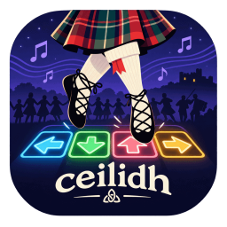
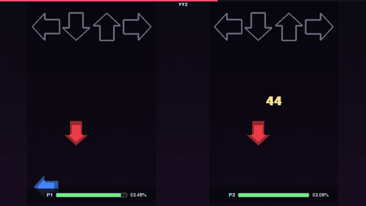
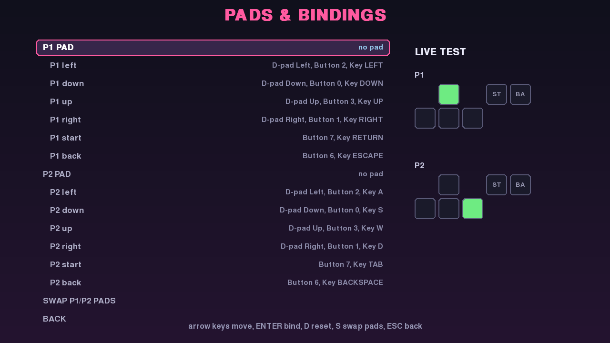
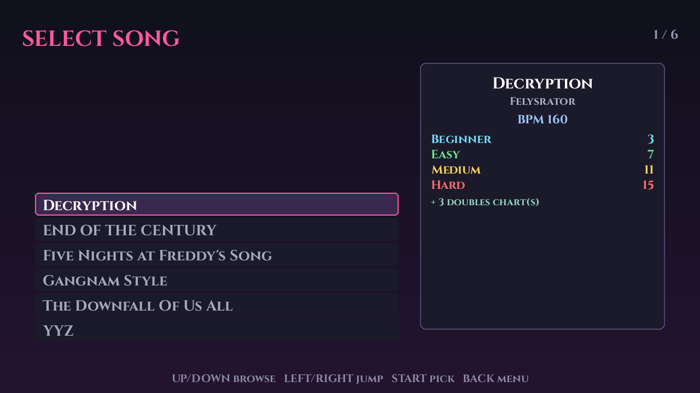
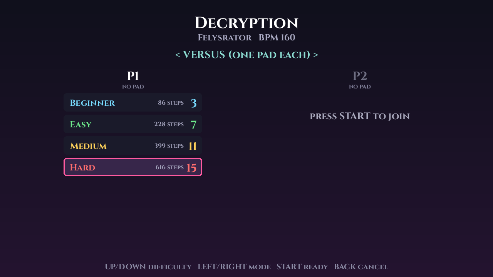
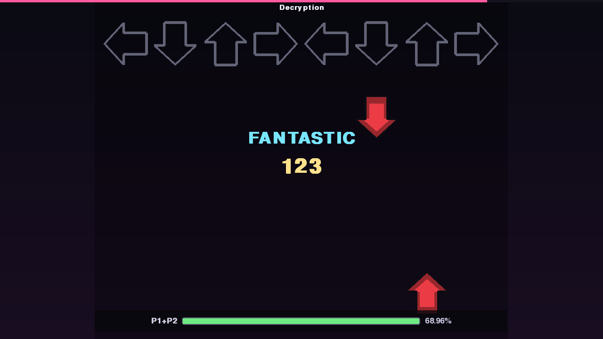
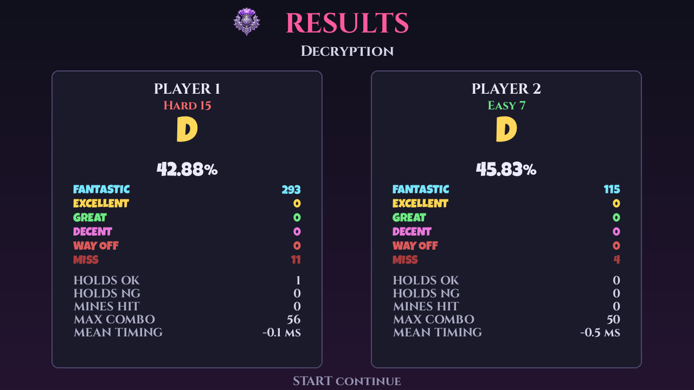

<p align="center">
  
</p>

# Ceilidh

[](https://github.com/affix/ceilidh/actions/workflows/ci.yml)
[](LICENSE)

A two pad dance game for macOS, Windows and Linux, built for a pair of Konami Xbox 360 dance pads and for playing whatever songs we feel like adding. A **ceilidh** is a social dance where nobody gets to stay in their seat, which is roughly the intent here.

## What is this?

A **dance mat game** is the arrow scrolling, foot stomping thing we all remember from the arcade: four panels, arrows climbing the screen towards a row of receptors, and a judgement for every step depending on how close to the beat it landed. Most of the open source options are either abandoned, awkward to build on an Apple silicon Mac, or unhappy about two controllers being plugged in at once. This one is a small Python codebase built on pygame-ce, so the same source runs on a MacBook, on a Windows desktop and on a Raspberry Pi 4 in the living room, and it treats two pads as the normal case rather than an afterthought.

It reads StepMania simfiles, so the enormous back catalogue of community packs works out of the box, and it will also generate a playable chart from any audio file we point it at. In this README we will get it installed, get both pads bound, add some songs, and calibrate the timing so that stepping on the beat actually scores like stepping on the beat.



*Five seconds of YYZ on Hard and Medium at once.*

## Just want to play it?

Grab a build from the [latest release](https://github.com/affix/ceilidh/releases/latest). Python and SDL are inside each one, so there is nothing else to install.

| Platform | File |
| --- | --- |
| Windows 10 or 11 | `Ceilidh-*-windows-x64.exe` |
| macOS | `Ceilidh-*-macos.tar.gz` |
| Raspberry Pi 4, 64 bit | `ceilidh_*_arm64.deb` |
| Debian or Ubuntu desktop | `ceilidh_*_amd64.deb` |

Neither desktop build is signed, so macOS wants a right click and Open the first time rather than a double click, and Windows shows a SmartScreen warning once. The rest of this README is for running from source, which is what we want if we intend to change anything.

## What do we need?

* Python 3.11 or newer, and [uv](https://docs.astral.sh/uv/) for dependency management.
* Two Konami (or any SDL compatible) Xbox 360 dance pads. Generic USB pads work too, they just need binding once.
* macOS on Apple silicon or Intel, Windows 10 or 11, or Linux including Raspberry Pi OS on a Pi 4.
* Optionally `ffmpeg`, which plays the background videos that ship with a lot of simfiles, and which the chart generator falls back to for audio formats libsndfile will not open.

Nothing needs to be installed system wide. `uv` builds a virtual environment in the project directory and pulls a pygame-ce wheel with SDL2 already bundled, which is what saves us from hunting down an Xbox controller kext on a modern Mac.

## Getting it running

```bash
uv sync
uv run ceilidh
```

That is the whole install. A few flags are worth knowing before the first launch:

```bash
uv run ceilidh --list-pads      # what SDL can actually see
uv run ceilidh --list-songs     # what the library scanner found
uv run ceilidh --bind           # go straight to the pad binding screen
```

If the game starts but the song list is empty, `--list-songs` will print every directory it searched, which is usually enough to work out where the songs went.

## Do the pads work?

Wired Xbox 360 controllers do not speak plain USB HID, which historically meant a kernel extension on macOS and a lot of swearing. SDL2 now ships its own HIDAPI driver for them, and the game enables it explicitly at startup, so both pads should appear without any driver install. On Linux the in tree `xpad` module has handled these pads for years and there is nothing to do at all, and on Windows they arrive through XInput, which is already part of the operating system. The game asks for SDL's own driver everywhere except Windows, where taking it over would mean replacing a driver that already works.

Run `--list-pads` first. Two entries, each with a GUID and a button/hat/axis count, means we are in business. The first pad found becomes player one, the second becomes player two, and the assignment is remembered by GUID so it survives a replug.

Konami pads report the four panels on the d-pad hat, with Start on button 7 and Back on button 6, and that is what the defaults assume. Third party pads often report the panels as ordinary buttons instead, so if a panel does nothing, open **Pads & Bindings** from the main menu. Every action can be rebound by selecting a row, pressing ENTER, and stomping the panel we want. Stepping on a pad while binding also claims that pad for that player, which is the quickest way to sort out two pads that came up in the wrong order. The screen carries a live test grid on the right hand side so we can confirm every panel registers before going anywhere near a song.

| Key | Action in the binding screen |
| --- | --- |
| Arrow keys | Move between rows |
| ENTER | Bind the selected action, then press the panel |
| D | Reset that action to the defaults |
| S | Swap the pads between player one and player two |
| ESC | Save and go back |



There is a keyboard fallback wired up at all times, which is handy for testing a chart without getting off the sofa. Player one is on the arrow keys with Enter and Escape, player two is on WASD with Tab and Backspace.

## Playing a song

Navigation is the same everywhere: the arrows move, Start selects, Back goes up a level. Any connected pad can drive the menus.



On the song wheel, up and down browse, left and right jump eight songs at a time, and the panel on the right shows the banner, the BPM and every difficulty in the file. Start opens the difficulty screen, where each player picks their own chart with up and down and locks it in with Start. A second player who did not join automatically can press Start to join, and Back to drop out again. Left and right toggle between the two modes:

* **Versus** gives each player their own four panel chart, their own life bar, their own scroll speed and their own score. The two players do not need to pick the same difficulty.
* **Doubles** gives player one all eight panels across both pads, using the song's `dance-double` charts. Songs without a doubles chart stay locked to versus.





The song starts after a three second count in. Start pauses, and `Q` while paused quits back to the song list. When the last note has gone past, the results screen breaks down every judgement, the hold and mine counts, the max combo and the mean timing error, then Start takes us back to the song wheel.



## Watching it play itself

**Demo mode** picks a song at random, puts its hardest chart on both playfields and plays it perfectly, rolling straight into another song when that one finishes. It is the attract loop for a party, and it doubles as the quickest way to eyeball a chart we have just generated or downloaded without getting on the mat.

```bash
uv run ceilidh --demo
```

It is also the second item on the main menu. Any button on any pad, or any key, drops back out of it.

## Filling the screen

The playfields size themselves from the window, so there is no fixed 720p layout hiding underneath: the arrows, the note spacing, the judgement text and the life bars all scale together, and the two fields tile the full width with the background showing between them. A scroll speed of 2.2 therefore looks the same on a laptop and on a television, because the spacing is measured in arrow heights rather than pixels.

Fullscreen toggles with **F11**, **Alt+Enter**, or **Cmd+F** on macOS, where F11 belongs to Mission Control. It is also remembered between runs, and `--fullscreen` or `--windowed` overrides it for one launch.

**Resolution** under Options is the setting worth knowing about. It defaults to 1280x720, which is the safe choice on a Pi, but on any decent display **native** is better: it renders at the desktop's own resolution instead of drawing 720p and letting SDL stretch it, so the arrows and text come out sharp. The presets are filtered to what the display can actually show, and the change applies the moment we pick it.

```bash
uv run ceilidh --resolution native --fullscreen
uv run ceilidh --resolution 1920x1080
```

## What plays behind the arrows?

Simfiles often ship a background video, and if one is sitting in the song folder we play it behind the playfields, cropped to fill and dimmed so the arrows stay readable. There is no video decoder in SDL and a decoding library would be a heavy dependency for something purely decorative, so the frames are piped out of `ffmpeg`: install it and videos play, leave it out and nothing else changes.

When there is no video, or no `ffmpeg` to play it with, the song's background image is used instead, and failing that the menu gradient. **Background** under Options turns video off if we would rather always have the still image, and **Background Dim** sets how far the whole thing is knocked back, from nothing at all up to almost black.

If the decoder falls behind the music, which it can on a Pi, the video jumps forward to catch up rather than drifting further and further out. Dropping `video_height` in the config file decodes at a smaller size and scales it up, which is the cheap way to keep video on a Pi.

## The artwork and the type

The arrows are painted rather than drawn: one piece of knotwork per direction, each with its own colour, so a glance tells us which panel a note belongs to without reading the shape. The same artwork does several jobs. A receptor is the arrow with the knotwork cut out of the middle, which the game works out at load by taking the alpha silhouette, eroding it, and subtracting the result to leave the outer frame. That keeps the exact colours of the original instead of recolouring it, and it means a target reads as somewhere to land rather than as a note that stopped moving. Mines, hit sparks, the logo and the thistle on the results screen come from the same set.

None of it is required. Every lookup falls back to the procedural shapes the game started with, so a checkout missing its assets still plays.

Two faces are bundled, both open licence. **Cinzel Bold** carries the labels, menus and song titles, and **Luckiest Guy** does the shouting: judgements, combos, the count in and the grades. Either falls back to pygame's built in font when its file is absent. Text is measured rather than counted when it has to fit somewhere, so a long song title wraps inside its panel and a long pad name ellipsises at the column edge instead of running off the side.

## Adding your own songs

There are four routes in, and they can be mixed freely in the same library.

### Where do songs live?

The scanner walks a handful of directories, up to four levels deep, and treats any folder containing a simfile as a song. The folder above it becomes the pack name shown on the song wheel, so a normal StepMania pack drops in unchanged.

* `songs/` next to the project, which is the obvious place for a handful of favourites.
* `~/Music/Ceilidh` on macOS, and `~/Ceilidh/songs` or `~/.local/share/ceilidh/songs` anywhere.
* `/var/lib/ceilidh/songs`, which is where the Debian package keeps them.
* Anything passed with `--songs DIR`, which is repeatable, or listed under `song_paths` in the config file.

### Dropping in a StepMania pack

Copy the pack in and restart, or pick **Rescan Songs** from the main menu. The parser handles `.sm` and `.ssc`, BPM changes, stops, per chart timing overrides, holds, rolls, mines and jumps, and it will find the audio, banner and background even when the header points at a file that has since been renamed. Singles and doubles charts are both read. A broken simfile never takes the library down with it; it is skipped, and the reason is printed to the console.

### Pulling songs from Zenius -I- vanisher

**Zenius -I- vanisher** is where the StepMania community has kept its simfiles for the best part of twenty years, and `tools/ziv.py` talks to it directly so we never have to go near a browser. It is stdlib only, so it runs on the Pi without installing anything.

```bash
uv run python3 tools/ziv.py search "breakfast club"      # find a song
uv run python3 tools/ziv.py search --packs rxsteps       # find a pack
uv run python3 tools/ziv.py latest                       # what went up today
uv run python3 tools/ziv.py info 1817                    # what is in a pack
uv run python3 tools/ziv.py get 70549                    # one song
uv run python3 tools/ziv.py get --pack 1817              # the whole pack
```

Both listings print the site's numeric ids, which are what `info` and `get` take, and a full `viewsimfile.php` or `viewsimfilecategory.php` URL works just as well if we already have one on the clipboard. A bare id is assumed to be a single simfile, and if it turns out to be a pack the tool notices and carries on.

Downloads land in `songs/` by default, unzipped into the folder layout the game already expects, and each new song is then parsed and printed back with its difficulties so we know immediately whether it is playable. Songs already in the library are skipped song by song, so re-running a pack picks up whatever has been added to it since last time without re-fetching the rest. Background videos come along with everything else and play behind the arrows; `--no-video` skips them, which cuts most of the download size if we are filling a Pi's SD card.

| Flag | What it does |
| --- | --- |
| `--out DIR` | Where to unpack, default `songs` |
| `--group NAME` | Put everything under one subfolder, which becomes the pack name in game |
| `--no-video` | Skip background videos, which are most of the download size |
| `--force` | Re-extract songs that are already there |
| `--dry-run` | Say what would be fetched and stop |
| `--keep-zip` | Keep the archive after unpacking |
| `--delay N` | Seconds between requests, default 1.5 |
| `--cookie` | A cookie header, for the rare thing that wants a login |

The site is run on donations and the tool makes one request at a time with a delay between them. Leave `--delay` alone, pull packs rather than hammering it song by song, and if the library is going to be a permanent fixture then put something in their tip jar.

### Writing a chart by hand

For something simple, or for a song we are charting ourselves, a `chart.json` beside the audio is usually less work than authoring a full simfile:

```json
{
  "title": "Example",
  "artist": "Someone",
  "music": "track.ogg",
  "offset": -0.04,
  "bpms": [[0, 171]],
  "stops": [],
  "sample_start": 32.0,
  "charts": [
    {
      "mode": "single",
      "difficulty": "Hard",
      "meter": 10,
      "notes": [[0, 1, "tap"], [1, 3, "tap"], [2, 0, "hold", 4], [6, 2, "mine"]]
    }
  ]
}
```

A note is `[beat, column, type]` with an optional fourth element for the beat a hold or roll ends on. Columns are `0` left, `1` down, `2` up and `3` right, and a doubles chart carries on with `4` to `7` for the second pad. The types are `tap`, `hold`, `roll` and `mine`. Beats are floating point, so an eighth note sits on `0.5`. The `offset` field follows the StepMania convention, that is, beat zero happens at `-offset` seconds into the audio, so a chart starting 40ms in wants `-0.04`. Multiple charts in the same file give us a difficulty ladder, and `mode` may be `single` or `double`.

### Generating a chart from audio

For a track we just want to dance to, the bundled generator will do the charting for us. It lives behind an optional dependency group because it pulls in librosa:

```bash
uv sync --extra autochart
uv run --extra autochart python3 tools/autochart.py track.mp3 --title "Track" --artist "Artist"
```

That writes `songs/track/chart.json` with easy, medium and hard charts and a copy of the audio. Beat trackers have a habit of locking onto half, double or three halves of the real tempo, so rather than trusting the first estimate the tool scores every plausible multiple against the onset envelope and keeps the grid that lands hardest on the music. On the two test songs it recovered 160.009 BPM at 0.048s and 170.995 BPM at 0.044s, against hand authored values of 160 at 0.0 and 171 at 0.04. Steps alternate feet and never repeat a panel on the same foot, and the density, jumps, holds and eighth notes all scale with the difficulty.

| Flag | What it does |
| --- | --- |
| `--difficulties` | Any of `beginner,easy,medium,hard,challenge`, default `easy,medium,hard` |
| `--bpm` / `--offset` | Override the detected grid when we already know the right answer |
| `--out` | Song folder, default `songs/<audio stem>` |
| `--link` | Symlink the audio instead of copying it |
| `--seed` | Change the random seed to reroll the patterns |

The result is an ordinary `chart.json`, so anything it gets wrong can be fixed by hand afterwards.

## Running it on Windows

Everything works the same way, with three differences worth knowing.

The pads need no driver at all. Windows has spoken XInput since it shipped, so a Konami mat turns up the moment it is plugged in, with the panels on the d-pad and Start and Back where the defaults expect them. `--list-pads` will confirm it.

Settings go to `%APPDATA%\ceilidh\config.json` rather than a dotfile, and songs are looked for in `%USERPROFILE%\Music\Ceilidh` and `%LOCALAPPDATA%\ceilidh\songs` as well as the `songs` folder next to the game. Simfile archives are full of titles containing `?` and `:`, which Windows will not accept in a filename, so the downloader quietly rewrites those characters when it unpacks.

Background video needs `ffmpeg` on the `PATH` as it does everywhere else; `winget install ffmpeg` is the easy route. Without it the game falls back to the song's background image.

```powershell
uv sync
uv run ceilidh
```

There is no installer. The Debian package is for the Pi, and on Windows we run it from the checkout, which is also how the tests run in CI.

## Getting the timing right

Every display and every audio stack adds latency, and on a dance mat the pad itself adds some more. **Calibrate Offset** on the main menu measures the lot in one go: a click plays twice a second, we step on the beat sixteen times, and the trimmed median of the error becomes the global offset. Stepping consistently matters far more than stepping accurately here, since a consistent bias is exactly what we are trying to cancel.

The number can also be nudged by hand under Options, or set for one run with `--offset MS`. A positive offset means the game treats our steps as happening later, which is what we want when the sound reaches us before the step registers. The results screen prints the mean timing error for the run, so an average that sits at `+15 ms` song after song is a sign the offset wants another 15 added to it.

If the timing feels fine but the judgements feel harsh, **Timing Windows** under Options scales every window at once, from half width for something brutal up to double for a party.

## Options

| Option | Notes |
| --- | --- |
| P1 / P2 Scroll Speed | Per player, 0.5x to 8x |
| Scroll Direction | Up or down |
| Speed Mode | Beat based (XMod), which follows BPM changes and freezes on stops, or constant (CMod) |
| Timing Windows | Scales all five judgement windows |
| No Fail | On by default, because nobody wants the music to stop at a party |
| Resolution | Native or a preset the display can show, applied immediately |
| Background | Video and image, or image only |
| Background Dim | How far the background is knocked back behind the arrows |
| Music Volume, Global Offset, Show FPS, Fullscreen | As expected |

Settings live in `~/Library/Application Support/ceilidh/config.json` on macOS and `~/.config/ceilidh/config.json` on Linux, and are written on exit. Anything left behind by an earlier version under a different name is picked up and carried across the first time we run. `--reset-config` deletes the file if a binding session ever goes badly wrong.

## Command line reference

| Flag | Purpose |
| --- | --- |
| `--songs DIR` | Add a song directory, repeatable |
| `--demo` | Start in demo mode |
| `--kiosk` | Appliance mode: fullscreen, no Quit item, attract loop when idle |
| `--attract-seconds N` | Idle seconds before the attract loop starts |
| `--resolution WxH` | Render resolution, or `native` for the desktop size |
| `--only-songs` | Search only the directories given with `--songs` |
| `--list-pads` | Print detected controllers and exit |
| `--list-songs` | Print the library and exit |
| `--bind` | Open the pad binding screen on launch |
| `--fullscreen` / `--windowed` | Override the saved display mode |
| `--width` / `--height` | Render size, the long way round |
| `--fps` | Frame rate cap, used when vsync is off |
| `--no-vsync` | Turn vsync off, which enables high rate input polling |
| `--audio-buffer N` | Mixer buffer in samples, 512 by default |
| `--offset MS` | Global audio offset for this run |
| `--reset-config` | Delete the saved config and start fresh |

## Running on a Raspberry Pi 4

`uv sync` picks up an aarch64 pygame-ce wheel with SDL bundled, and the pads are handled by the kernel, so there is nothing extra to build. The game draws 720p at roughly a quarter of a millisecond of CPU work per frame on a laptop, which leaves plenty of headroom on a Pi, but two settings are worth knowing about.

If the audio crackles, raise the mixer buffer with `--audio-buffer 1024`. The cost is a little more output latency, which the calibration screen will happily absorb. Leave the frame rate at 60 and vsync on, since the Pi has no headroom to spare for spinning the input loop, and leave the resolution at 1280x720 rather than native unless a test says otherwise.

Background video is the one feature to be careful with. Decoding and blitting full screen frames is real work for a Pi 4, so either set `video_height` in the config to something like 360, which decodes small and scales up, or turn **Background** off and enjoy the still images.

On a desktop the opposite trade is available. Input is sampled once per frame, so a 60Hz loop puts up to 16ms of jitter on every step timestamp, which is most of a Fantastic window. Running with `--no-vsync --fps 240` switches the main loop over to spending its slack polling the event queue instead of sleeping in one lump, which brings the jitter down to a millisecond or two at the cost of occasional tearing.

## Turning a Pi into an appliance

**Kiosk mode** is the game with the edges filed off for a machine that lives in the living room and has no keyboard next to it. It starts fullscreen, drops the Quit item from the menu, and falls into the demo loop whenever the menu sits idle for 45 seconds, so walking past a switched on Pi shows a song playing itself rather than a menu. Stepping on anything brings it back.

```bash
ceilidh --kiosk --attract-seconds 30
```

Since there is no Quit item, leaving takes a deliberate act: hold Back for three seconds on the main menu and a countdown appears. On a machine running the service, stopping it over ssh is the other way out.

## Building a standalone app

For a machine that should not need Python installed at all, PyInstaller will fold the game, its dependencies and the interpreter into one thing we can hand over.

```bash
uv sync --group package
uv run python tools/build-app.py
```

Whichever platform we run that on is what comes out: `dist/Ceilidh.exe` on Windows, `dist/Ceilidh.app` on macOS, and a folder on Linux. PyInstaller cannot cross compile, so there is no building a Windows executable from a Mac; CI builds both on their own runners and uploads them from every push, which is the easiest way to get one without owning the other machine. The Windows build is a single file by default, which takes a second or two to unpack itself on launch, and `--onedir` trades that for a folder that starts immediately.

The icon is converted on the way in. Windows wants an `.ico` and macOS wants an `.icns`, so the script scales the one PNG into every size each format expects, writing the `.ico` by hand and handing the `.icns` to the `iconutil` that ships with macOS. Nothing extra to install either way.

A bundled build looks for songs next to itself, so a `songs` folder beside the `.exe`, or beside the `.app` rather than buried inside it, works the way people expect. The usual `~/Music/Ceilidh` and `%LOCALAPPDATA%` locations still apply.

Both builds are unsigned. On macOS that means Gatekeeper will refuse an `.app` that arrived from anywhere other than the machine that built it, and the way past it is right click, Open, rather than a double click. On Windows, SmartScreen will warn the first time. Signing them properly needs a developer certificate on each platform, which is a paperwork problem rather than a code one.

## Building the Debian package

`tools/build-deb.sh` produces a `.deb` that carries its own virtualenv, so the Pi needs nothing installed beyond glibc and a sound card, and there is no pip step on the target at all. The build runs inside a pinned `debian:bookworm-slim` container, which means we can build the arm64 package on a Mac without any cross compiling faff.

```bash
tools/build-deb.sh                  # arm64, for 64 bit Raspberry Pi OS
tools/build-deb.sh --arch amd64
tools/build-deb.sh --arch armhf     # 32 bit Pi OS, emulated and slow
tools/build-deb.sh --native         # already on Debian, skip Docker, wants root
```

The result is about 8.5 MB packed and 40 MB installed. It puts the app in `/opt/ceilidh`, a `ceilidh` and a `ceilidh-ziv` wrapper in `/usr/bin`, a desktop entry for machines with a desktop, and the kiosk unit in `/lib/systemd/system`. Installing it creates a system user called `ceilidh` in the `video`, `render`, `input`, `audio` and `tty` groups, which is what lets it reach the console, the pads and the sound card without a login session.

```bash
sudo apt install ./ceilidh_*_arm64.deb
sudo systemctl enable --now ceilidh-kiosk
```

The unit conflicts with `getty@tty1`, since the login prompt and the game would otherwise fight over the console, so enable it on a machine we can still reach over ssh. SDL picks its own video driver, which means X or Wayland when a desktop session is running and KMSDRM on a bare console, and the unit has commented lines for forcing either if it guesses wrong.

Songs live in `/var/lib/ceilidh/songs`, which is group writable so we can drop packs in without becoming root, and `ceilidh-ziv` is the downloader if we would rather pull them straight onto the Pi:

```bash
ceilidh-ziv get --pack 1817 --out /var/lib/ceilidh/songs
```

Removing the package stops and disables the service. Purging it takes the virtualenv and the user with it but deliberately leaves the song library alone, because no packaging system should be allowed to delete a few gigabytes of somebody's music on the way out.

## Cutting a release

Tagging is the whole process. The version in `pyproject.toml` is the source of truth, and the workflow refuses to release if the tag disagrees with it.

```bash
git tag v0.1.0
git push origin v0.1.0
```

That builds the Windows executable, the macOS bundle and the Debian package for both `amd64` and `arm64`, then attaches all four to a GitHub release with notes explaining which file is for what. The Pi package is built under emulation, so it is the slowest part by a distance. A tag with a suffix, `v0.2.0-rc1` for instance, is published as a prerelease.

Running the workflow by hand from the Actions tab instead produces a draft release, which is a way to rehearse the whole thing without a tag or anything public appearing.

## Running the tests

The judging, timing, parsing and config code has no pygame in it, so the suite runs headless and in well under a second.

```bash
uv sync
uv run pytest
```

There are 251 unit tests across the timing map, the judgement windows and scoring, the lane state machine, both simfile parsers, the song models, the library scanner, the config file and the pad binding syntax. They never open a window or a sound device: `tests/conftest.py` pins SDL to its dummy drivers, so a test run is always silent. CI runs them on Linux, macOS and Windows, which is what keeps the cross platform claims honest.

## How does scoring work?

Judgements follow the ITG windows, at 21.5ms for a Fantastic, then 43ms, 102ms, 135ms and 180ms for Excellent, Great, Decent and Way Off. Anything later than the last window is a Miss.

Score is the familiar dance points percentage: a Fantastic is worth 5, an Excellent 4, a Great 2, a Decent nothing, a Way Off minus 6 and a Miss minus 12, with a completed hold worth another 5 and a mine costing 6. The percentage is what we earned over what was available, and the grade comes off that, from a D up through the S grades to three stars for a perfect run. Holds need the panel held down, with a quarter second of grace for a stumble, and rolls need repeated stomps at least twice a second. Mines only hurt if we are standing on the panel as they pass.

## When this fails

**`--list-pads` shows no controllers.** Check the cable first, then that nothing else has grabbed the device. On Linux, confirm `xpad` loaded with `dmesg | grep -i xpad`, and that our user can read the `/dev/input/event*` node.

**A panel does nothing in game but lights up in the binding screen's test grid.** The binding is attached to the other player. Use S to swap the pads, or rebind that player's panels directly.

**Both players move the same arrows.** Both pads ended up assigned to one player, which happens if only one was plugged in when the config was first written. Bind each player's pad from the **P1 PAD** and **P2 PAD** rows, or delete the config with `--reset-config`.

**The music and the arrows disagree.** Run the calibration, and if it is still out, check whether the simfile's own offset is wrong by comparing against another player. Per song offsets are read straight from the simfile, so a badly synced download stays badly synced.

**The background video does not play.** Check `ffmpeg -version` actually runs. A broken Homebrew install is the usual culprit on macOS, where an upgrade can leave `ffmpeg` linked against a library version that is no longer there; `brew reinstall ffmpeg` fixes it. The game checks that ffmpeg both exists and runs before using it, and quietly falls back to the background image when it does not.

**A song is missing from the wheel.** `--list-songs` prints the reason for every file it skipped. The usual cause is a simfile with no audio next to it, or a pack nested more than four directories deep.

## Licence

MIT. See [LICENSE](LICENSE).

Songs are not covered by it: simfiles and their audio belong to whoever made them, which is why the song folders are kept out of this repository.

The two bundled faces keep their own licences, both of which sit beside them in `ceilidh/assets/fonts`. Cinzel is under the SIL Open Font Licence and Luckiest Guy under Apache 2.0.

## Project layout

```
tests/          unit tests, headless and silent
ceilidh/
  cli.py        argument parsing and start up
  app.py        screen stack and the main loop
  screen.py     Screen base class and menu key repeat
  config.py     settings and pad bindings, loaded from and saved to JSON
  input.py      SDL joystick and keyboard events mapped onto player actions
  chart.py      note, chart and song models
  audio.py      music clock, drift correction, generated click sounds
  library.py    song directory scanning
  paths.py      where things live, running from source or from a bundle
  assets/       artwork, the icon, and the two bundled faces
  display/      window.py, art.py, arrows.py, fonts.py, icon.py, widgets.py,
                theme.py, video.py
  gameplay/     timing.py, judge.py, lane.py, playfield.py, background.py, demo.py
  simfile/      sm.py and jsonchart.py parsers behind one load()
  screens/      menu, song select, gameplay, results, pad setup
tools/
  autochart.py  chart generation from audio
  build-app.py  standalone .exe / .app build, icons and all
  ziv.py        simfile search and download from Zenius -I- vanisher
  build-deb.sh  Debian package build, run in a container
packaging/
  ceilidh-kiosk.service, control.in, postinst, prerm, postrm, ceilidh.desktop
```
